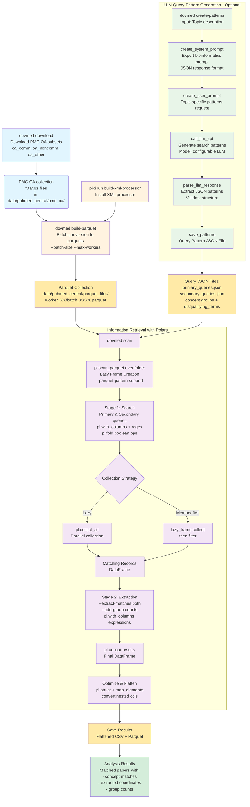

# 
python package for text search and extraction from NCBI's PubMed Central Open Access subset.  

**Note**: This project is not affiliated with NCBI or PubMed Central in any way. The pubmed central OA
is not being redistributabed here. Instead, we provide (for convinience) CLI scripts to download and format it into modern file formats (i.e. parquet), from the offical NCBI FTP site.  

## Overview
The package contains:
- rust based xml processor for converting PMC tar.gz files to parquet format.
- miscellaneous helper scripts and examples.
-  `dovmed` CLI commands bundling the some of the unctionality:
    - `dovmed download` - Download PMC OA data subsets
    - `dovmed build-parquet` - Convert PMC tar.gz files to parquet format  
    - `dovmed create-patterns` - Generate query patterns using LLM
    - `dovmed scan` - Scan literature for patterns and extract matches

Use `dovmed COMMAND --help` for detailed help on any command.

## Installation

### For Users
```bash
pip install polars-dovmed
```
The CLI is now available as `dovmed`
Pre-built wheels should include the Rust-accelerated XML processor for Linux, macOS, and Windows.

### For Developers
```bash
# Clone the repository
git clone https://github.com/urineri/polars-dovmed.git
cd polars-dovmed

# Install pixi if you don't have it (Linux only)
curl -fsSL https://pixi.sh/install.sh | bash

# Build and install in development mode
pixi run build
pixi install
# you may want to install in an editable mode for development, something like:
pixi shell
pip install -e .

```

**Releasing (maintainers):** Push a git tag (`git tag v0.1.1 && git push origin v0.1.1`) to automatically build wheels for all platforms and publish to PyPI via GitHub Actions.

## Addtional functionality
1. We provide a set of patters for extracting biological sequence coordinates from text (e.g. "the active site is located from 12 to 20"), as well as common database names and accession formats (e.g. GenBank, RefSeq).
2. The `dovmed scan` command is powered by the [Polars](https://www.pola.rs/) library, which provides a performant and flexible datafrme library. The polars search,filter and extraction expressions are generated from a user provided query file(s). By default these are jsons contatins regex/text patterns/terms of user interest, but `--simple-mode` can be used to provide a plain text file with one pattern per line.
3. `dovmed create-patterns` can use any OpenAI compatible provider to help generate the query patterns.
4. The `dovmed build-parquet` uses a custom rust based xml processor to convert the PMC tar.gz files to parquet format in a parallel fashion. 
5. The collection of parquet files can be used with any other tool or query engine that supports parquet files (e.g. Spark, Polars, DuckDB, etc.).


## Usage

### Quick Start (after installation)

### 0.1 Getting the PMC OA full-text collection
pmc_oa is divided based on license: oa_comm (commercial), oa_noncomm (noncommercial), oa_other (see [terms of use here](https://pmc.ncbi.nlm.nih.gov/tools/openftlist/) for more info).  
For your convinience, we have provided a script to download the full-text collection based on the subsets.
#### Download pmc_oa subsets
```bash
dovmed download oa_comm oa_other \
    --output-dir data/pubmed_central \
    --max-connections 5 \
    --verbose
```  
Or download all subsets:
 ```bash 
dovmed download oa_comm oa_noncomm oa_other \
    --output-dir data/pubmed_central \
    --max-connections 5 \
    --verbose
```

**Note**: This will create the directory structure:
```
pmc_oa/
├── oa_comm/
│   └── *.tar.gz files
├── oa_noncomm/
│   └── *.tar.gz files
└── oa_other/
    └── *.tar.gz files
```  
These tar.gz files from NCBI can weigh in at ~100-200GB, so make sure you have enough space to store them.

#### 2. Convert pmc_oa to parquet
**Note!**, this is a "lossy" conversion - some of the XML tags are lost in this process.  

Batch conversion to parquets:  
```bash
dovmed build-parquet \
    --pmc-oa-dir data/pubmed_central/pmc_oa/ \
    --parquet-dir data/pubmed_central/parquet_files/ \
    --batch-size 5000 \
    --max-workers 8 \
    --subset-types oa_comm oa_noncomm oa_other \
    --verbose --log-file logs/convert_pmctargz_parquet.log
```

This creates batched parquet files organized by worker directories:
```
parquet_files/
├── worker_00/
│   ├── batch_0001.parquet
│   └── batch_0002.parquet
├── worker_01/
│   └── batch_0001.parquet
└── worker_02/
    └── batch_0001.parquet
```

### Create the query file
The main input for the search step is the query file(s), which is a json of structure:
```json
{{
        "concept_group_1": [
                ["pattern_1", "pattern_2", ...],
                ["pattern_1", "pattern_2", ...],
                ...
        ],
        "concept_group_2": [
                ["pattern_1", "pattern_2", ...],
                ...
        ],
        ...
        "disqualifying_terms": [
                ["term1"],
                ["term2"],
                ...
        ]
}}
```  
The terms and patterns can be simple regexs, and ideally lean on special chars. Ideally these will include your target concepts' keywords as plain strings. 
**NOTE** - these doens't support all regex syntax tricks you may be used to from perl, bash or python defaults' (e.g. no lookahead or forwards), because the backend is [rust's regex crate](https://docs.rs/regex/latest/regex/#syntax). 
The disqualifying_terms are an OPTIONAL list of terms that if any of them is present in the text, the entire manuscript will be ignored. I recommend using this to remove "false positives" papers, which might match your patterns but are not relevant, like alternative acronym disambiguating - for example if you are looking for "ALS" (the amyotrophic lateral sclerosis disease) you can add "advance light source" to the disqualifying_terms list to avoid potential "collisions".

For your convenience, you can use the `create-patterns` command to generate a query file based on your input text. This requires access to any Open-AI compatible provider (e.g. litellm, openai, openrouter). The script contains a predefined system-message, also in [`data/assets/patterns/system_prompt.txt`](data/assets/patterns/system_prompt.txt) (if you do not have access to an LLM inference API, you can try copy pasting this txt file to a "free" webchat, followed by your input text). Similarly, we used this text to creata Google ["gem"](https://gemini.google.com/gem/17xzHaBNx6T-5nbQ0KJPHKHaKctK0sUCa?usp=sharing) with the same instructions.
```bash
dovmed create-patterns \
    --input-text "RNA secondary strucutre elements and motifs used in the genomes of RNA viruses" \
    --output-file "data/assets/patterns/your_queries.json" \
    --model "gpt-oss-120b" \
    --api-base "https://YOUR.API.PROVIDER.COM" \
    --api-key $YOUR_API_KEY
```  

**NOTES**: 
- you can use the llm generated input as a starting point, and remove/edit it further.
- The quality of the LLM response varies, some models will return worse results than others. We have tried with gemini2.5 Flash, gemini2.5 pro, gpt-oss-120b, and llama-scout-7b. 


### Scan the parquet files for input queries.
Note: you might want to first test only using a small subset of the parquet files. You could then use the results to improve the query file(s), while getting a sense for the expected runtime and memory usage. This can be achived be using the `--parquet-pattern` argument, for example:
```bash
  --parquet-pattern "data/pubmed_central/pmc_oa/parquet_files/worker_00/*01.parquet" 
```  
For more detailed (live) resource usage, I recommend using `top` externally and tracking the memory usage. For troubleshooting the queries, you can also enable verbose logging with `--verbose` and `--log-file` to get more detailed logs.

tl;dr:
```bash
$ dovmed scan --help
Unified Literature Processing Pipeline with Polars Lazy Evaluation

options:
  -h, --help            show this help message and exit
  --parquet-pattern PARQUET_PATTERN
                        Glob pattern for parquet files (e.g., 'data/pubmed_central/parquet_files/*/*.parquet')
  --queries-file QUERIES_FILE
                        JSON file containing search queries (required unless using --simple-mode)
  --output-path OUTPUT_PATH
                        Output path for processed data (without extension)
  --search-columns SEARCH_COLUMNS
                        Columns to search for patterns
  --identifier-patterns-file IDENTIFIER_PATTERNS_FILE
                        JSON file containing identifier patterns
  --coordinate-patterns-file COORDINATE_PATTERNS_FILE
                        JSON file containing coordinate patterns
  --extract-matches {primary,secondary,both,none}
                        Which queries to extract matches for: primary, secondary, both, or none
  --secondary-queries-file SECONDARY_QUERIES_FILE
                        JSON file containing secondary search queries to apply after primary filtering
  --secondary-search-columns SECONDARY_SEARCH_COLUMNS
                        Columns to search for secondary patterns (comma-separated). If not provided, uses same columns as primary search
  --add-group-counts {primary,secondary,both}
                        Add columns counting matches for each pattern group: primary, secondary, or both
  --min-queries-per-match MIN_QUERIES_PER_MATCH
                        Filter the results to only keep those that are matched by at least this many different query groups
  --log-file LOG_FILE   Path to log file for detailed logs
  --verbose             Enable verbose logging
  --simple-mode SIMPLE_MODE
                        Simple mode: provide a text file with one pattern per line instead of JSON queries
```


#### Standard Mode (JSON queries)
A typical scan command would be:
```bash
dovmed scan \
    --parquet-pattern "data/pubmed_central/pmc_oa/parquet_files/worker_*/*.parquet" \
    --queries-file primary_queries.json \
    --secondary-queries-file secondary_queries.json \
    --add-group-counts secondary \
    --extract-matches both \
    --output-path results/processed_literature \
    --verbose
```

#### Simple Mode (Text file patterns)
For simpler use cases, you can use `--simple-mode` with a text file containing one pattern per line (similar to grep's patterns file):

```bash
dovmed scan \
    --parquet-pattern "data/pubmed_central/pmc_oa/parquet_files/worker_*/*.parquet" \
    --simple-mode my_patterns.txt \
    --output-path results/simple_scan \
    --verbose
```

**Simple mode features:**
- One pattern per line in a plain text file
- Lines starting with `#` are ignored
- Empty lines are skipped
- Patterns are used "as is" without complex regex processing
- The concept group is automatically named after the file stem (e.g., `my_patterns.txt` becomes concept group "my_patterns")
- Cannot be used together with `--queries-file` or `--secondary-queries-file`

#### **Note**
The `scan` command uses some polars magic to parallelize over the different parquet files in a somewhat efficient way. By default, it will use all available CPUs, but you can limit the number by setting the `POLARS_MAX_THREADS` environment variable BEFORE running the script, e.g.:
```bash
export POLARS_MAX_THREADS=16
```

#### Understanding a "regular" vs Secondary Queries files 
- **Primary queries**: The first search patterns, Papers will onlyy be included in results if they match at least one primary query pattern.  
- **Secondary queries**: Additional filtering patterns applied **after** primary matching. These help narrow down results to more specific contexts or add supplementary information extraction.
- **`--extract-matches`**: Controls which query matches to extract from the text:
  - `primary`: Extract only primary query matches
  - `secondary`: Extract only secondary query matches  
  - `both`: Extract matches from both primary and secondary queries
  - `none`: Skip match extraction (faster, only returns matching papers)
- **`--add-group-counts`**: Adds columns counting how many times each pattern group matched:
  - `primary`: Count matches for primary query groups
  - `secondary`: Count matches for secondary query groups
  - `both`: Count matches for both primary and secondary groups  
#### Why do we need secondary queries?
In case you want to do the text extraction/match-counting for ony specific patterns, or if certain patterns are not specific to your core research interest, but you still want to extract them from litrature that does match your core interest. For example, ["phenotypic traits"](examples/phenotypic_traits/phenotypic_schema.json) may have keywords that would match many papers (like gram-positive) while you are intereted in specific microbes (see the ([examples/accessions_phenotypic/]) example).  

## General Workflow  



## Citation
If you use polars-dovmed in your research, please cite the following preprint:
```
@article{neri2026polarsdovmed,
  title={polars-dovmed: polars powered python package for Local Information Retrieval from the PubMed Central Open Access subset},
  author={Neri, Uri and Roux, Simon and Schulz, Frederik and Vasquez, Yumary},
  journal={bioRxiv},
  year={2026},
  publisher={Cold Spring Harbor Laboratory}
}


****************************

*** Copyright Notice ***

polars-dovmed (dovmed) Copyright (c) 2026, The Regents of the University
of California, through Lawrence Berkeley National Laboratory (subject to
receipt of any required approvals from the U.S. Dept. of Energy). All rights reserved.

If you have questions about your rights to use or distribute this software,
please contact Berkeley Lab's Intellectual Property Office at
IPO@lbl.gov.

NOTICE.  This Software was developed under funding from the U.S. Department
of Energy and the U.S. Government consequently retains certain rights.  As
such, the U.S. Government has been granted for itself and others acting on
its behalf a paid-up, nonexclusive, irrevocable, worldwide license in the
Software to reproduce, distribute copies to the public, prepare derivative 
works, and perform publicly and display publicly, and to permit others to do so.


****************************


*** License Agreement ***

GPL v3 License

polars-dovmed (dovmed) Copyright (c) 2026, The Regents of the University
of California, through Lawrence Berkeley National Laboratory (subject to
receipt of any required approvals from the U.S. Dept. of Energy). All rights reserved.

This program is free software: you can redistribute it and/or modify
it under the terms of the GNU General Public License as published by
the Free Software Foundation, either version 3 of the License, or
(at your option) any later version.

This program is distributed in the hope that it will be useful,
but WITHOUT ANY WARRANTY; without even the implied warranty of
MERCHANTABILITY or FITNESS FOR A PARTICULAR PURPOSE.  See the
GNU General Public License for more details.

You should have received a copy of the GNU General Public License
along with this program.  If not, see <https://www.gnu.org/licenses/>.

